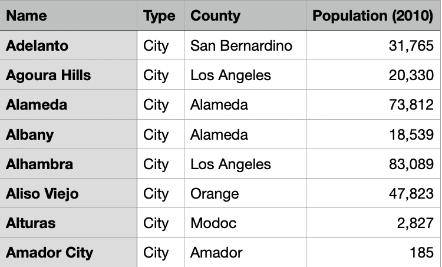

# Hashtables

## Introduction
In order to store information efficiently, it is important to structure it in a way that makes the data easily re-accessible. When we have a two-pair tuple where the first index is a key and the second index is the information, similar to a dictionary, we need a way to efficiently store a large number of tuples in order to re-access them at a later time. Rather than placing all these tuples into a list and searching through them linearly, hashtables allow us to map keys to specific bins where we can store these tuples. This exponentially increases our search efficiency and allows us to find information much more quickly at the expense of additional setup time.

Think of it as a Marie-Kondo-approved method of organization, where you have a set of bins with different labels -- computer games, lego, books. For Mario Kart, you would put it in computer games, your LEGO airport shuttle model would be put it in the bin labeled legos and finally, your collection of Harry Potter books would be put in the bin labeled books. This might take some time to set up, but because you have organized them into well-defined storage boxes, you will be able to look for your item very quickly as compared to searching sequentially through a big box of items where you might have to look through every single item before you find the lego piece. 

## Packages
To run the notebook the following packages are required:
1. [NumPy](https://numpy.org/)
2. [pandas](https://pandas.pydata.org/)
3. [lolviz](https://github.com/parrt/lolviz)

To install these packages simply run the following commands in your terminal.
```
$ pip install numpy
$ pip install pandas
$ brew install graphviz
$ pip install lolviz
```

## The Data
 The dataset used for this illustration contains the populations of all cities and towns in the state of California in 2010. The dataset contains four columns: name, type, county, and population. The source of the data can be found [here.](https://www.downloadexcelfiles.com/us_en/download-excel-file-list-cities-california-state#.YWMrCC1h30o)


## Implementation 
<b><u>htable_get()</u></b><br>
The htable_get function is our lookup function that takes in 2 parameters: the hash table created and the key of interest. The function first utilizes the hashcode function to get the index of the bucket where the key is located. It then searches linearly within that specific bucket to look for the key. If the key is found, the function will return its value, otherwise it will return None. 

For this particular example, you can see that using a hash table speeds up the time it takes to look up Yucca Valley’s population by about 4 times. 


